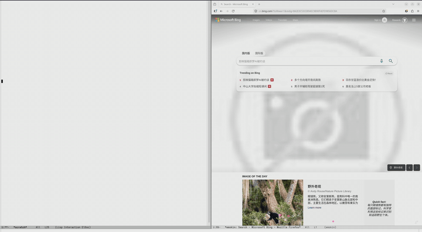

# fcitx5-anytalk

Linux 语音输入：在任何应用内按 **F2**，对着麦克风说话，文字直接进入当前焦点输入框。

底部一条悬浮胶囊条会显示音频电平和实时字幕，整段录完后一次性上屏，不会污染输入框。



## 安装

### Arch / Manjaro（推荐）

```bash
yay -S fcitx5-anytalk
```

### 其他发行版

参考 [docs/architecture.md](docs/architecture.md#从源码构建) 从源码构建。

## 首次配置

第一次使用前先填语音识别凭据：

```bash
anytalk-overlay --settings
```

会弹出对话框，选 ASR 后端（目前是**豆包**），填 AppID 和 Access Token。

> 豆包凭据从 [火山引擎控制台](https://console.volcengine.com/speech/app) 申请，开通"流式语音识别大模型"服务。

凭据保存在 `~/.config/fcitx5/conf/anytalk.conf`。

### Sway / wlroots 用户

加这一行到 sway 配置，让 D-Bus 拉起的悬浮窗能拿到 Wayland 环境：

```
exec dbus-update-activation-environment --systemd WAYLAND_DISPLAY XDG_CURRENT_DESKTOP XDG_SESSION_TYPE
```

KDE / GNOME 自动处理，无需此步。

### 在空 workspace / 桌面无焦点时也能 F2

fcitx5 的按键事件依赖输入法上下文（InputContext）——焦点在某个应用的输入框时才触发。
若你需要在空 workspace 或纯桌面下也按 F2 唤起，需要在合成器层绑定 D-Bus 调用：

**Sway** (`~/.config/sway/config`)：

```
bindsym F2 exec busctl --user call \
    org.fcitx.Fcitx5.AnyTalk.Overlay /overlay \
    org.fcitx.Fcitx5.AnyTalk.Overlay ToggleRecording
```

**Hyprland** (`~/.config/hypr/hyprland.conf`)：

```
bind = , F2, exec, busctl --user call org.fcitx.Fcitx5.AnyTalk.Overlay /overlay org.fcitx.Fcitx5.AnyTalk.Overlay ToggleRecording
```

**i3**：

```
bindsym F2 exec --no-startup-id busctl --user call org.fcitx.Fcitx5.AnyTalk.Overlay /overlay org.fcitx.Fcitx5.AnyTalk.Overlay ToggleRecording
```

合成器层绑定后会**先于**应用消费 F2，等同于 fcitx5 那条路——但能覆盖空焦点场景。同理 `StopRecording` / `CancelRecording` 也可以绑到 Enter / Esc。

## 使用

```
任意应用 → 按 F2 → 说话 → 按 F2 / Enter 结束
```

| 快捷键 | 行为 |
|---|---|
| **F2** | 开始录音 / 结束并提交 |
| **Enter**（录音中） | 结束并提交 |
| **Esc**（录音中） | 取消，丢弃这一段 |
| **F2 / Esc**（错误时） | 关闭错误提示 |

录音时屏幕底部出现一条 dock：状态点 + 实时音频条 + 流式字幕。结束后整段文字一次上屏。

## 文档

- [docs/architecture.md](docs/architecture.md) — 架构、D-Bus 接口、添加新 ASR 后端、源码构建
- [docs/doubao-asr-api.md](docs/doubao-asr-api.md) — 豆包语音识别协议参考

## 致谢

感谢 [cdcode.org](https://cdcode.org) 提供的模型能力。

## 许可证

[MIT](LICENSE)
